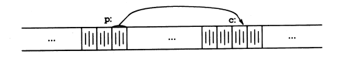
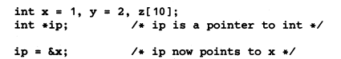
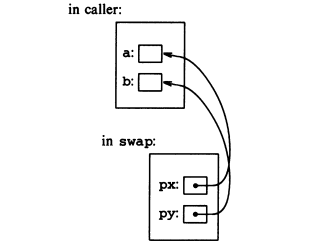
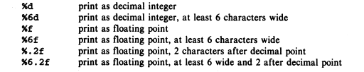

# The C Programming Language, Second Edition (ANSI C), but condensed 
Here my condesed version of the C Programming Language, at least the most important parts in my opinion. 
### Compiled examples
All can be found in `compiled`. To compile for your computer:
```sh
sh compile.sh
```
# Pointers 

Pointers are exactly what the name says, a pointer to a specfic area in memory.
<br> 
It contains a memory address, which we can get by doing:
```c
int c = 5;
int* p = &c;
```
The variable `p` is now a pointer, "pointing" to c. We got the address of `c` by using `&`(used as `&c`). The "C Programming Language" puts it like this:

Now with this pointer, we can do stuff with it. For example, we can increment the value of `c`:
```c
*p = *p + 5; //adds 5 to c. 
```
Here is a use case for pointers. <br> 
# Use case for pointers
C sends arguments to functions as their value, so there is no way to change the variables that were sent to a function.<br>
Here is the example that the "C Programming Languge" uses.
<br> Lets take this function as an example:
```c
// Function to swap the values of two variables
void swap(int x, int y){
  int temp = x;
  x = y;
  y = temp; 
}
```
Now, lets say we have two variables:
```c
int a = 6;
int b = 2;
```
and we want to swap their values. We cannot do: 
```c
swap(a,b);
```
The way to do this is by sending the address of the variables and then change the values at those address:
```c
swap(&a,&b);
```
We should also change the orginal function:
```c
void swap(int* px, int* py){
  int temp = *px;
  *px = *py;
  *py = temp;
}
```
Once again, as the book illustrates it:

The `swap` example is provided in `pointers/swap.c`. 


## Some stuff (refrence stuff)
### Chapter 1
  * List of `printf` commands
