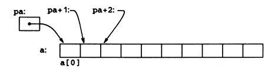

# The C Programming Language, Second Edition (ANSI C), but condensed 
### By @the-electro-bros on replit
Here my condesed version of the C Programming Language, at least the most important parts in my opinion. 
### Compiled examples
All can be found in `compiled`. To compile for your computer:
```sh
sh compile.sh
```
# Pointers 

Pointers are exactly what the name says, a pointer to a specfic area in memory.
<br> 
It contains a memory address, which we can get by doing:
```c
int c = 5;
int* p = &c;
```
The variable `p` is now a pointer, "pointing" to c. We got the address of `c` by using `&`(used as `&c`). The "C Programming Language" puts it like this:

Now with this pointer, we can do stuff with it. For example, we can increment the value of `c`:
```c
*p = *p + 5; //adds 5 to c. 
```
Here is a use case for pointers. <br> 
## Use case for pointers
C sends arguments to functions as their value, so there is no way to change the variables that were sent to a function.<br>
Here is the example that the "C Programming Languge" uses.
<br> Lets take this function as an example:
```c
// Function to swap the values of two variables
void swap(int x, int y){
  int temp = x;
  x = y;
  y = temp; 
}
```
Now, lets say we have two variables:
```c
int a = 6;
int b = 2;
```
and we want to swap their values. We cannot do: 
```c
swap(a,b);
```
The way to do this is by sending the address of the variables and then change the values at those address:
```c
swap(&a,&b);
```
We should also change the orginal function:
```c
void swap(int* px, int* py){
  int temp = *px;
  *px = *py;
  *py = temp;
}
```
Once again, as the book illustrates it:

The `swap` example is provided in `pointers/swap.c`. 
<br>
The compiled version for Replit is provided in `compiled/swap`. 
## Pointers + Arrays
Lets init a int array:
```c
int a[10];
```
This creates 10 objects, all from `a[0]` to `a[9]`. If we want to assign a pointer to the adress of an `i`th element in the array:
```c
int* pa = &a[i]
```
To dump the contents into a variable we do:
```c
int x = *pa; 
```
`x` now contains the contents of `a[i]`.
<br>
Now, if `pa` contains `a[i]`, then `*(pa + 1)` should contain `a[i+1]`. 
<br>
The book puts it like this:

# Structs
The way I think of structs in C is that they are kinda like classes in C++ or any other OOP langauge, except they cannot have functions in them. 
<br>
They are basicly contaniers of many variables. 
```c
struct user{
  char* name;
  int age;
};
```
To create an instance of this could be like:
```c
struct user testuser = {"Test User",25};
```
If we would want to grab the data from this struct, we just do:
```c
char* that_persons_name = testuser.name;
int that_persons_age = testuser.age;
```
We could nest it in another struct:
```c
struct four_user_chat_room{
  struct user userone;
  struct user usertwo;
  struct user userthree;
  struct user userfour;
};
```
Now as with every function in C they must have a return type (except for `void`) and you can return structs:
```c
struct user newuser(char* name, int age){
  struct user temp = {name, age};
  return temp;
}

//lets call it
struct user dude = newuser("Function user",26);
```
<br>
<br>
<br>
<br>

# Some stuff (refrence stuff)
## Chapter 1
  * List of `printf` commands
